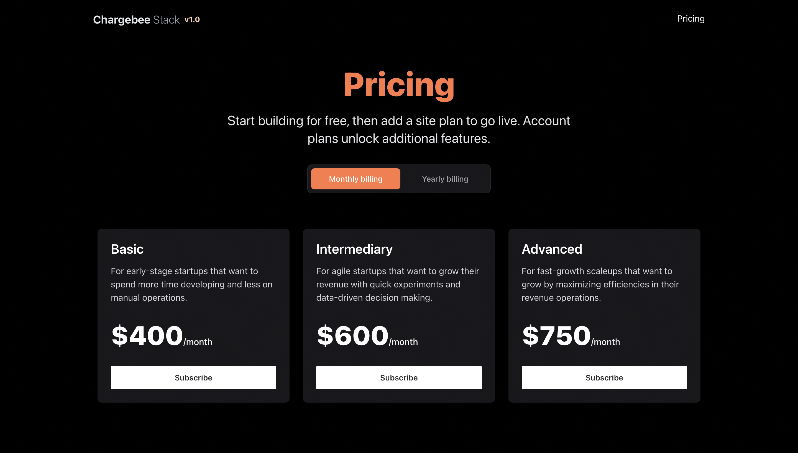

# Chargebee Subscription Saas Starter

A Chargebee focused T3 Stack that integrates User Subscriptions, Authentication and Testing. Driven by Prisma ORM. Deploys to Vercel

## Features

- Full stack typesafety with t3-stack.
- Database ORM with Prisma.
- Automatic deployment to Vercel
- Styling with Tailwind.css + Tailwind Prettier-Plugin.
- Linting with ESLint.
- Code formatting with Prettier.
- Out of the box Authenticaton.

## Demo

[https://chargebee-saas-stack.vercel.app/](https://chargebee-saas-stack.vercel.app/)

## 📝 License

This project is licensed under the MIT License - see the [LICENSE.md](LICENSE) file for more information.

## Credits

Inspired from [Vercel Subscription Template](https://github.com/vercel/nextjs-subscription-payments)
